# Application Projects

The wizard has generated a whopping number of projects - 18! 
It may seem scary at firsts, but the truth is that we aren't going to touch most of these projects:
* Development will be done in the model and application projects, 
* Tests will be developed in the tests project with supporting classes in the UI driver projects.
* Documentation will be hosted in the documentation project and/or in the model and application projects.  

The sections below provide a quick overview of each project's role in the solution.

## org.nasdanika.bank
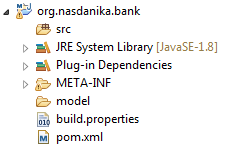

## org.nasdanika.bank.aggregator

## org.nasdanika.bank.app
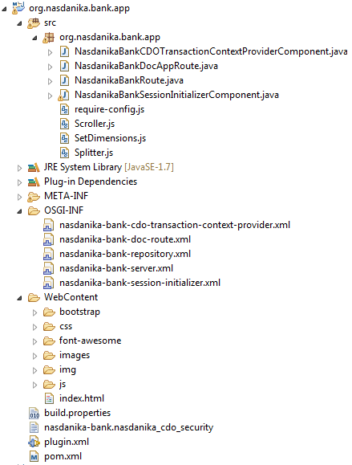

## org.nasdanika.bank.doc
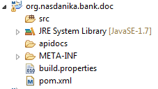

## org.nasdanika.bank.feature
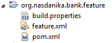

## org.nasdanika.bank.parent

## org.nasdanika.bank.product
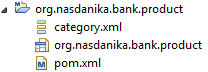

## org.nasdanika.bank.product.feature
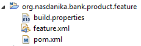

## org.nasdanika.bank.product.parent
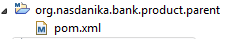

## org.nasdanika.bank.repository
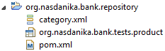

## org.nasdanika.bank.target
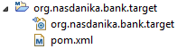

## org.nasdanika.bank.tests
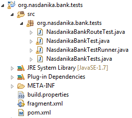

## org.nasdanika.bank.tests.feature
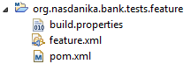

## org.nasdanika.bank.tests.results
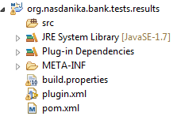

## UI Driver

### org.nasdanika.bank.ui.driver.actors
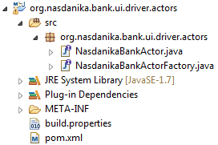

### org.nasdanika.bank.ui.driver.actors.impl
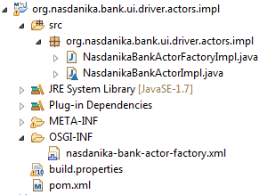

### org.nasdanika.bank.ui.driver.pages

### org.nasdanika.bank.ui.driver.pages.impl
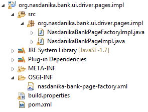

## Summary

