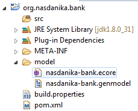
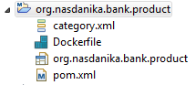

# Application Projects

The wizard has generated a whopping number of projects - 18! 
It may seem scary at first, but the truth is that we aren't going to touch most of these projects:
* Development will be done in the model and application projects, 
* Tests will be developed in the tests project with supporting classes in the UI driver projects.
* Documentation will be hosted in the documentation project and/or in the model and application projects.  

The sections below provide a quick overview of each project's role in the solution.

## org.nasdanika.bank

This is an EMF project which will contain the application domain model. Currently there is no model, we will create it later.
An application may have more than one model project and can reference models from plugins, e.g. the [security model](http://www.nasdanika.org/server/apidocs/org.nasdanika.cdo.security/apidocs/index.html). 




## org.nasdanika.bank.aggregator

Using an aggregator pom appears to be a [Tycho builds](http://www.vogella.com/tutorials/EclipseTycho/article.html) best practice. Our aggregator pom lists all modules to be built, configures JavaDoc links, and sets output location for Javadoc to be ``apidocs`` folder in ``org.nasdanika.bank.doc`` project.
 


## org.nasdanika.bank.app

The application project is probably where the most of development activity will take place.


Right after generation the project contains the following artifacts:

### OSGi components
There are 5 OSGi component definitions (Please note that the diagram above was automatically generated by the documentation system)


#### nasdanika-bank-cdo-transaction-context-provider.xml

* Provided service - [CDOTransactionContextProvider](http://www.nasdanika.org/server/apidocs/org.nasdanika.cdo/apidocs/org/nasdanika/cdo/CDOTransactionContextProvider.html) component,
* Implementation class - ``org.nasdanika.bank.app.NasdanikaBankCDOTransactionContextProviderComponent``. 

This component provides transaction context for web routes managed by the routing servlet in ``org.nasdanika.cdo.web`` bundle. 

It creates contexts by using [CDOSessionProvider](http://help.eclipse.org/mars/topic/org.eclipse.emf.cdo.doc/javadoc/org/eclipse/emf/cdo/session/CDOSessionProvider.html) service to obtain [CDOSession](http://help.eclipse.org/mars/topic/org.eclipse.emf.cdo.doc/javadoc/org/eclipse/emf/cdo/session/CDOSession.html), open [CDOTransaction](http://help.eclipse.org/mars/topic/org.eclipse.emf.cdo.doc/javadoc/org/eclipse/emf/cdo/transaction/CDOTransaction.html) and then wrap the transaction into a context.

 
#### nasdanika-bank-doc-route.xml

This route serves documentation content. It uses ScrService to obtain runtime information about [DS](http://www.vogella.com/tutorials/OSGiServices/article.html) components, and CDOSessionProvider service to get access to the session package registry.
  
#### nasdanika-bank-repository.xml

This component exposes RepositoryProvider service backed by and embedded H2 database.

In our application session provider (client), server, and H2 database reside in the same JVM. As we will see in the [Scaling Up](../../chapter-5-scaling-up/README.md) chapter the application can be vertically scaled by running a standalone H2 (or another) database, a server process connected to the database, and client processes connected to the server. 

#### nasdanika-bank-server.xml

This component provides CDOSessionProvider service. It uses RepositoryProvider service to obtain repository, and zero or more CDOSessionInitializer services to initialize sessions - e.g. register packages and/or create initial repository content.

#### nasdanika-bank-session-initializer.xml

* Service - ``CDOSessionInitializer``
* Implementation class - ``org.nasdanika.bank.app.NasdanikaBankSessionInitializerComponent``

Currently this component does nothing. Once we create a domain model we will modify the component implementation class to register the model package in the session package registry and create initial repository content if it does not exist.

In our application there is one session initalizer and it is defined in the application bundle. In the case of multiple models it may make sense to define session initializer components in model bundles. 

### Route classes and JavaScript files

There are two route classes and route registrations in ``plugin.xml``

#### NasdanikaBankDocAppRoute

This route provides a container for the documentation content. It uses javascript file resources - require-config.js, Scroller.js, SetDimensions.js, Splitter.js. 

The reason for separation of documentation route and documentation application route is to separate content from style and make look-and-feel of the documentation system adjustable by the developers, e.g. wrapping the documentation system into an organization's web application template. 

#### NasdanikaBankRoute

This route is generated for testing that the application is functional.

### WebContent

Web content is expanded from ``org.nasdanika.web.resources`` bundle and ``index.html`` is generated by the wizard to redirect to the first element of ``NasdanikaBank`` CDO Resource:

```html
<html>
	<head>
		<title>Nasdanika Bank</title>
		<META http-equiv="refresh" content="0;URL=/nasdanika-bank/router/elements/NasdanikaBank/0.html">
	</head>
	<body>
		Redirecting to the home page.
	</body>
</html>
```

In our application we will use web resources directly from the bundle and as such all web content except index.html can be safely deleted.
 
Using resources from the resources bundle makes the application cleaner because it does not contain third-party artifacts. For example, the documentation application route loads web resources from the web resource bundle, not from the WebContent folder.
 
The reason why the wizard unpacks the web resources bundle is because there are situations when it is easier to use resources from the WebContent folder.  

## org.nasdanika.bank.doc


This bundle will contain documentation, in particular - aggregated JavaDoc.

## org.nasdanika.bank.feature


The feature project defines plugins and features which constitue the application:


## org.nasdanika.bank.parent


The parent project contains the parent pom with definitions common for all projects.

## org.nasdanika.bank.product


The product project contains files which define how to build and Eclipse product for the application. 
Also, the product file was used to launch the application in Eclipse. 

## org.nasdanika.bank.product.feature


As it will be described in detail in the next section, our build is a bit more complex than a regular Tycho/Maven build because we want JavaDoc's and test results to be included into the final product.  This feature is for the final product. 


It includes the application feature plus documentation and test results bundles.

## org.nasdanika.bank.product.parent


Parent pom for "product" projects:
* org.nasdanika.bank.product.feature
* org.nasdanika.bank.product
* org.nasdanika.bank.doc
* org.nasdanika.bank.tests.results

## org.nasdanika.bank.repository


Repository project defines how to build a P2 repository for our application. 
The repository will be used to build the final product. 

This project also contains a tests product definition - it will be used to execute UI tests from Eclipse. 

## org.nasdanika.bank.target


Target project contains target definition which was used to set up a target platform. 
The target definition can also be used during the build by adding it to the list of modules to the aggregator pom.xml

## org.nasdanika.bank.tests


This project contains tests and and Eclipse application which runs them - ``NasdanikaBankTestRunner``.

During the Maven/Tycho build the tests are executed by the Surefire plugin. 
In Eclipse we will use the tests product to execute the tests. 

## org.nasdanika.bank.tests.feature


The tests feature defines plugins and features which constitute the tests product:


## org.nasdanika.bank.tests.results


This project belongs to the product build and it is a container for the test results produced by the "repository" build.

## UI Driver

UI driver abstracts tests from the UI and provides facilities for recording test execution with screenshots so it
can be presented to users/business to facilitate understanding of how the application works. 

A detailed description of the UI driver concept can be found in [Nasdanika WebTest](https://github.com/Nasdanika/server/wiki/webtest) documentation. 

Here we will provide a very short overview


### org.nasdanika.bank.ui.driver.actors


This project defines actor and actor factory interfaces or specifications. Actor interface methods represent coarse-grained "business" actions, e.g. Sign-On or Pay Bill. 

### org.nasdanika.bank.ui.driver.actors.impl


Classes in this project implement actor and actor factory specifications. There is an OSGi component which references the page factory service and provides actor factory service to the tests. The WebTest framework injects the actor factory service into test classes.

### org.nasdanika.bank.ui.driver.pages


This project defines page and page factory interfaces. Page interface methods represent fine-grained UI actions, e.g. enter login, enter password, click button, read value from the screen.

### org.nasdanika.bank.ui.driver.pages.impl


Classes in this project implement page and page factory specifications. There is an OSGi component which provides page factory service to the actor factory component. 

## Summary

Hopefully after this overview the list of projects doesn't look as scary anymore. The next step is to build the Eclipse product for our application in Eclipse and then launch it from Eclipse or command line. 

 

