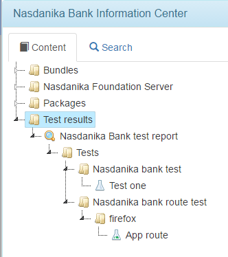

# Build and Launch Locally

## Build

There are two ways to build an Eclipse product in Eclipse.

### Eclipse Product Export Wizard

For this we'd need to open the product file, in the Exporting section click on "Elipse Product export wizard" link. 


Uncheck "Synchronize before exporting", enter export location and click "Finish".


### Maven builds

A typical Maven/Tycho build is pretty straightforward - run ``mvn clean verify`` in the aggregator project and the build will produce an Eclipse product.

Our build process is a bit trickier because we want our product to contain JavaDoc and test results. Therefore there are two pom.xml files which will be used and each will be executed twice with different goals.

Project        | Goals                           | Comment 
---------------|:-------------------------------:|:--------
aggregator     | package                         | The product parent requires the application repository even in order to execute the clean task.   
product.parent | clean                           | Cleans javadoc output directory in the doc project and test results output directory in the test results project.
aggregator     | clean package javadoc:aggregate | Generates aggregated JavaDoc and puts it to the doc project.  
aggregator     | verify                          | Builds bundles, executes tests and stores them to the test results project, builds a repository. 
product.parent | package                         | Uses the repository from the previous step and doc and test results bundles to build an Eclipse product.

The first row shall be executed only if there is no repository from the previous build, e.g. we build for the first time. However, in this case we don't have to execute product.parent clean. So when we run a build for the first time we can start from the third row.   

Tycho cannot load content from local repositories and we need to expose the repository over HTTP. 
It can be done in a variety of ways, e.g. by using a local web server like Apache. 
Perhaps the simplest way is to use [Winstone Servlet Container](http://winstone.sourceforge.net/).

So, before we invoke the product.parent build for the first time we shall start Winstone. It can be done from the command line as shown below 

```console
java -jar winstone-0.9.10.jar --webroot=<workspace location>\org.nasdanika.bank.repository\target\repository --controlPort=8081 
```
 
However, a better way is to create an external tool configuration:
 

 
When we are done with the build Winstone can be shut down either manually by Ctrl-C, or by issuing the following command in the command line:
```console
java -cp winstone-0.9.10.jar winstone.tools.WinstoneControl shutdown
```
 
Once again we prefer to do everything from Eclipse and so we create another external tool configuration by duplicating the "Start Winstone" configuration and changing arguments to ``-cp <path to winstone jar> winstone.tools.WinstoneControl shutdown``.
 
 

Winstone port collides with the application port and therefore Winstone shall be down when aggregator verify is being executed. An alternative is to change Winstone port number.
 
All these steps can be scripted, but in this section we will execute them manually - there is another section dedicated to setting up an automated build. We start from the clean workspace so the sequence would be:
* aggregator package javadoc:aggregate
* aggregator verify
* Start Winstone
* product.parent package
* Shutdown Winstone

For subsequent builds the sequence would be:
* Start Winstone
* product.parent clean
* Stope Winstone
* aggregator package javadoc:aggregate
* aggregator verify
* Start Winstone
* product.parent package
* Shutdown Winstone

The section below show how to create build configurations.

### product.parent clean

Here is how it can be done:
* Right click on the ``org.nasdanika.bank.product.parent`` project
* Select "Run As"
* Select "Maven clean"

 

### Custom Maven builds

For the first build configuration for particular project right click on the project and select "Run As > Maven build", or use ``Alt-Shift-X, M`` hot key.


For subsequent build configurations right click on the project and select "Run As > Maven build...". 
 
When the configuration dialog opens, modify the launch configuration name, if needed, and enter goals.


Then click "Run". This has to be done only once per build configuration. In subsequent builds just select a run configuration from the dropdown list:


## Launch

After completing all the build steps there should be an Eclipse product for Windows in the target directory of the  product project:  


We launch the product by double-clicking on ``eclipse.exe``. A window opens with a familiar OSGi console output:


 
To validate that the application is functional we can open either the test route URL (``http://localhost:8080/nasdanika-bank/router/nasdanika-bank.html``) or the documentation route URL (``http://localhost:8080/nasdanika-bank/router/doc.html``) in a browser.

## Test results

Our Eclipse product contains ``org.nasdanika.bank.tests.results`` bundle, where the build process stored the results of automated UI tests. 
When we open the documentation system in the browser there is a new node in the documentation tree - Test results:



The "Test results" root node contains nodes for test sessions, currently there is one test session - Nasdanika Bank test report:


The session details page shows:
* Session name (title)
* Fully qualified name of the session class linked to JavaDoc (which is also packaged with the product). The JavaDoc is generated with source links, i.e. it takes two clicks from the report to tests sources.
* Node where the test was run.
* Session timestamp.
* Session description, if present.
* Tests tab:
  * Pie chart depicting distribution of tests statuses. Currently there is one pending test and one passed. Tests can also have "Fail" and "Error" statuses.
  * A table listing tests in the session with links to details, description, and status summaries for each test. These tests are also available under the "Tests" sub-node of the test session node.
* Actors tab - not present because we don't have any actors participating in tests yet.  

Click on "Nasdanika bank test" navigates to the test details:

 

Similar to the test session, test class details page shows class title, qualified name linking to JavaDoc, description, status pie chart, and a table of test methods. There is one method in "Pending" status:

.

Note that a pending test icon is an empty flask, and the status glyph-icon is a gray flask.

"Nasdanika Bank route test" is a parameterized test. The details page contains a parameter descriptors table with parameter title, description, field name, and field type linked to JavaDoc. The tests section contains a pie chart of statuses and a table of tests with different parameter permutations:


Tests with different parameters are also represented as sub-nodes of the test node:


The details page of a test with a given combination of parameters contains a table listing parameters - title (name), value, description, and type, a pie chart of method statuses, and a table of test methods with their statuses. 
A click on a method navigates to the method details page.


In the example above the test is passed - it's icon is a flask with green contents. The test details page contains a carousel with screenshots taking during the test, currenlty there is only one screenshot. A click on the screenshot opens it in a [lightbox](lokeshdhakar.com/projects/lightbox2/) dialog. 

An image can also be opened in a new tab by right-clicking on the image and selecting "Open image in new tab" (in Chrome).  

## Shutdown

To shutdown the application type ``shutdown`` in OSGi console and press Enter. If the window doesn't close after a few seconds, type another command, e.g. ``ss`` and press Enter - it should close the window.

## Summary

We built a shippable product which can be deployed to Windows or Linux machines. The next step is to dockerize it. 

