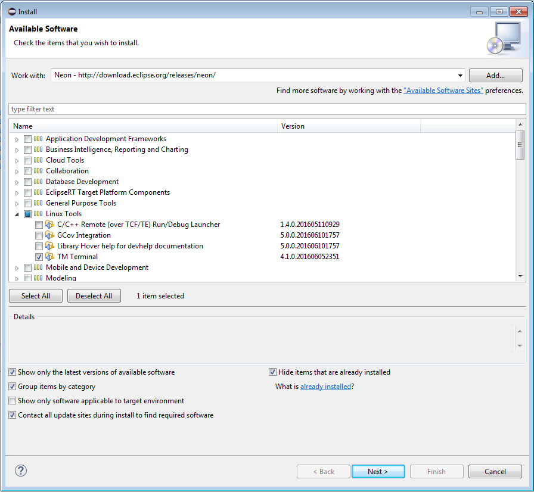
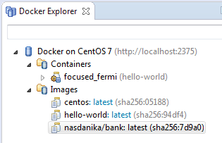
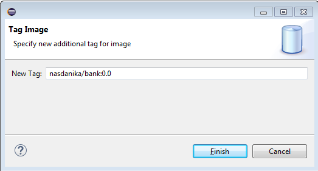

# Dockerize

Our application is pretty much self-contained - all its files resize in a single directory, which can be zipped and distributed similar to how Eclipse IDE is distributed (it is also an Eclipse product). However, it still requires Java and Graphviz.

To bring self-containment of our application to the next level we will dockerize it, i.e. create a [Docker](http://www.docker.com/) image with the application, Java and Graphviz. 

## Install Eclipse Docker Tools and Terminal

We did not install Eclipse Docker Tools during the initial setup, so let's do it now: 
* Help > Install New Software, 
* Select the Neon repository,
* Filter for "Docker",
* Check "Docker Tooling":


* Clear the filter and check "TM Terminal" in "Linux Tools":



* Click "Next" and follow the installation instructions.

## Create a Docker Connection

* Window > Perspective > Open perspective > Other
* Select "Docker Tooling":


* In the Docker Explorer on the left click the link to create a new connection.
* Fill out connection details. In my environment I have CentOS 7 VM with Docker daemon running in Oracle Virtual Box on my local machine:   


* Click "Test Connection" to make sure that it works, and then click "Finish". 
* Click on the new connection to explore images and containers:


## Build an image

The wizard has generated a Dockerfile in the product project, and the build process has copied it to the ``target/products/org.nasdanika.bank.product/linux/gtk`` directory. 

!]product-project-structure](product-project-structure.png)

Now we shall create a Docker image for the application. To do so we right click on the Dockerfile in the target directory and select Run as > Docker image build. 


Then specify the build configuration:


The build will execute and output its progress to the console:


Once it completes, there will be a new image in the docker explorer:

 

## Open port and forward

In my setup I had to open a port in the firewall and also forward it to the host port.

This is how to open a port on CentOS, the last line is for verification: 

```
firewall-cmd --zone=public --add-port=8080/tcp --permanent
firewall-cmd --reload
firewall-cmd --list-all
```
The screenshot below shows the port forwarding configuration:


## Run image

To run the image right-click on it and select Run:


In the Docker container settings dialog uncheck "Publish ... to random ..." and check "Keep STDIN...", "Allocate pseudo-TTY...", and "Automatically remove...":


   
Click "Finish". A terminal view will open up with an already familiar output:


Also there will be a new running container in the Docker Explorer:


Now if we open ``http://localhost:18080/nasdanika-bank/router/doc.html`` in a Web browser, we shall see the documentation system.


## Shutdown 

To shutdown the container use the terminal - type ``shutdown``, press Enter. If the cursor is still blinking after several seconds, enter another command, e.g. ``ss`` and press Enter.

## Push to Docker Hub

To share the image with others we shall push to a registry, Docker Hub in our case. 

First of all we shall create a registry account by going to Window > Preferences menu, selecting Docker > Registry Accounts, clicking Add, and entering account information:


Then we shall tag our image. We right-click on the image and
select "Tag":


and enter new tag into the tag dialog. We are in chapter 0, so 0.0 seems to be an appropriate tag:



And then right-click again, and select "Push":


In the push image dialog select a tag and a registry account:


When we click "Finish" our image will get uploaded to the registry:


If we click "Details >>", we can see upload progress for image layers:


When push completes we can see a new tag on https://hub.docker.com/r/nasdanika/bank/tags/:


## Summary

Now we have a Docker image with our application and we have shared it with the world. 
Currently the image is interactive - in order to shutdown the application we had to use the OSGi console. 
It shall be OK for now. 
In the [Scaling Up](../../chapter-6-scaling-up/README.md) chapter we will modify the application to gracefully shutdown on ``SIGTERM``.

The next step is set up an automated build and deployment of our application and Docker images. 


