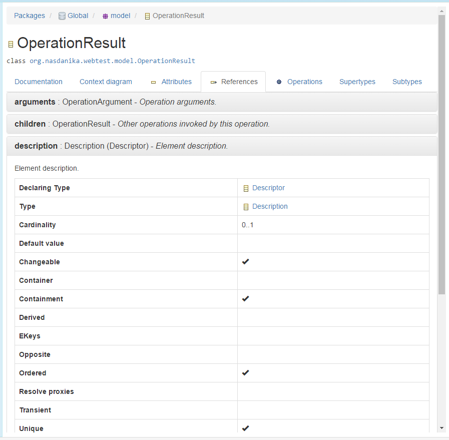

# Documentation System

## Bundles

The documentation system collects runtime information about OSGi bundles and components and presents it in the Table Of Content (to be precise - the Tree Of Content, but it still abbreviates to TOC). 

The application bundles in the tree are grouped by their common prefix for the ease of navigation. 

If a bundle hosts service components, component nodes are mounted as bundle node children:

A mouse click on a bundle node opens bundle documentation in the content container on the right of the content tree:

Bundle documentation displays the bunle path in the content tree on the top several tabs described below. Custom tabs can be added with ``bundle-toc`` element of ``org.nasdanika.toc`` extension point.

### Overview

The overview tab displays the general bundle information as shown above.

### Required bundles

If the bundle requires other bundles they are displayed on this tab. 

Bundle symbolic names are rendered as links. A click on a link navigates to a respective bundle documentation.

### Headers

This tab displays a table of headers not otherwise displayed in other tabs.

### Registered Services

If the bundle has registered services - through declarative components or by other means - they are displayed in this tab.

Service types and properties types are rendered as links to JavaDoc. Component names, if a service was exposed by a DS component, are rendered as links to component documentation. Using bundles are also rendered as links.

### Services In Use

If the bundle uses any services, they are displayed in this tab. The services in use table is very similar to the registered services table.

[Bundle Documentation - Services In Use](bundle-documentation-services-in-use.png)

### Context diagram 

The context diagram tab provides a graphical representation of bundle relationships:

 
The diagram can be customized using the toolbar:

* Direction - relationship direction - both, in, or out.
* Depth - how many levels of relationships to include.
* Dependencies - whether to show dependencies (required bundles). Dependencies are shown as dashed lines.
* Services - whether to show services exposed/referenced. Service relationships are shown as solid lines.
* Components - whether to display bundle components.
* Types - service typ names - hidden, short, or fully qualified.
* Left-to-right changes layout direction of the diagram.
* Fit width - diagram is scaled to the viewport width.
* Filter - opens a dialog to set bundle include/exclude filters, e.g. to show only the application's or ogranization's bundles. Default include/exclude filters can configured through the documentation route properties. 

The diagram below displays bundle components and service relationships with fully qualified service interface names:

## Components

Similarly to the bundle documentation, service component documentation is organized into several tabs. 
Custom tabs can be added with ``component-toc`` element of ``org.nasdanika.toc`` extension point.

### Overview 

This tab displays general component information with links to provided services and implementation class JavaDocs.

### Properties

This tab lists component properties with JavaDoc links to property types:

### References

If a service component references other components, this tab is displayed and provides information about references:

### Referenced by

This tab lists components referencing a given component:

### Context diagram

The context diagram tab provides a graphical representation of component relationships. 

The diagram can be customized via toolbar controls:

* Direction - relationship direction - both, in, or out.
* Depth - how many levels of relationships to include.
* Types - service typ names - hidden, short, or fully qualified.
* Left-to-right changes layout direction of the diagram.
* Fit width - diagram is scaled to the viewport width.
* Filter - opens a dialog to set bundle include/exclude filters, e.g. to show only the application's or ogranization's bundles. Default include/exclude filters can configured through the documentation route properties. 

## Packages

The packages node allows to explore [EPackages](http://download.eclipse.org/modeling/emf/emf/javadoc/2.11/org/eclipse/emf/ecore/EPackage.html) available in the running OSGi system. EPackages contain [EClasses](http://download.eclipse.org/modeling/emf/emf/javadoc/2.11/org/eclipse/emf/ecore/EClass.html), which constitute the application domain model.

There are two sub-nodes under the packages node - Global and Session. The global node lists EPackages registered in the global package registry ``EPackage.Registry.INSTANCE`` and the session node displays packages registered in the session registry, e.g. by session initializers. 
The session node is displayed only if the documentation route is configured to consume [CDOSessionProvider](http://help.eclipse.org/neon/topic/org.eclipse.emf.cdo.doc/javadoc/org/eclipse/emf/cdo/session/CDOSessionProvider.html) service. 

Global and session nodes can be removed from the content tree through documentation route configuration.

### EPackage

EPackage documentation has a header with the package name and namespace URI and the following tabs:

#### Documentation

If EPackage is documented, i.e. has a GenModel documentation annotation, the documentation is displayed in 
this tab:

#### Diagram

This tab contains an auto-generated UML diagram depicting package classes and their relationships.

As of time of writing the diagram is static and not configurable. A configuration toolbar, similar to the one for the bundle context diagram, will be added in the future.

#### Classes, Enumerations, Data Types

These tabs lists [EClassifier](http://download.eclipse.org/modeling/emf/emf/javadoc/2.11/org/eclipse/emf/ecore/EClassifiers.html)s - EClasses, 
[EEnum](http://download.eclipse.org/modeling/emf/emf/javadoc/2.11/org/eclipse/emf/ecore/EEnum.html)s
and [EDataType](http://download.eclipse.org/modeling/emf/emf/javadoc/2.11/org/eclipse/emf/ecore/EDataType.html)s defined in the package:

#### Sub-nodes

A package node contains sub-nodes for EClassifiers and sub-packages defined by the package:

.

#### Custom tabs and sub-nodes

Additional tabs and sub-nodes can be mounted to the package documentation with ``epackage-toc`` element of ``org.nasdanika.toc`` extension point.

### EClass 

EClass documentation consists of a header with the class name, a link to the underlying Java class JavaDoc and several tabs:

#### Documentation

#### Context diagram

This tab contains an auto-generated UML diagram depicting the class and its relationships.

As of time of writing the diagram is static and not configurable. A configuration toolbar, similar to the one for the component context diagram, will be added in the future.

#### Attributes

If a class has attributes - own or inherited, this tab is present and contains an accordion with attributes details.

#### References

If a class has references - own or inherited, this tab is present and contains an accordion with reference details.

#### Operations

If a class has non-route operations - own or inherited, this tab is present and contains an accordion with reference details.

#### Routes

This tab is present if the class has routes. There is currenlty no routes. Routes will be explained in the
[UI chapter](../chapter-4-ui/README.md). 

#### Supertypes

If a class has supertypes, this tab is present and contains an table listing the supertypes.

#### Subtypes

If a class has subtypes known to the documentation route, this tab is present and contains an table listing the subtypes.

Additional tabs and sub-nodes can be mounted to the class documentation with ``eclassifier-toc`` element of ``org.nasdanika.toc`` extension point.

### EEnum

EEnum documentation contains enumeration name, a link to the underlying Java enum JavaDoc, documentation text, if any and an accordion with enumeration literals documentation:

Tabs and sub-nodes can be mounted to the enumeration documentation with ``eclassifier-toc`` element of ``org.nasdanika.toc`` extension point.

### EDataType

EDataType documentation contains the data type name, a link to the underlying Java type JavaDoc, and documentation, if any.

Tabs and sub-nodes can be mounted to the data type documentation with ``eclassifier-toc`` element of ``org.nasdanika.toc`` extension point.

## Custom content

TODO - work in progress.

Nodes under Nasdanika... contain mostly hand-crafted documentation content, e.g. an article describing how to configure the documentation route.

How to add content, screenshot of the schema tree and extension declaration. Content - text, markdown, html

### Markdown

While the documentation system supports text and HTML, markdown is considered the primary documentation authoring format. 

The documentation system provides

markdown

extensions - resolvers, renderers, ...

We can say that markdown with configurable resolvers is an application Domain Specific Language (DSL) - the documentation content can be written "in terms of" Java classes (JavaDoc resolver), bundles, components, domain classes, and user story objects, e.g. actors. 

## User Stories and Test Results

We don't have any user stories or test results in the system yet, so there are no TOC nodes for them. 

We'll return to these documentation artifacts once we have them in the system. 

## Search

TODO - search, link to Lucene docs.

Search for Bank, screenshot

## Different documentation configurations for different audiences

The workspace wizard has generated a single documentation application route class and a single documentation route component. It is enough to get started with development. At some point, however, it may make sense to create multiple documentation URL's for different audiences.

For example, developers/contributors need access to all documentation, but the business people may get confused by the bundles, global packages, and information about configuring the system - for them it will be noise.

Technical people may need to see only a sub-set of bundles relevant to understanding how the system components are wired together, but they don't need to see all the underlying OSGi bundles. The also don't need to see the system configuration information, which is relevant to the developers.   

As such, three documentation routes and three documentation application classes may be created for different audiences and configured to display content as shown in the below table:

Content           | Contributors | Business | Technology 
------------------|:------------:|:--------:|-------------
Bundles           | x            |          | Filtered to organization/applications bundles.
Custom content    | x            | Filtered to organization/applications bundles.  | Filtered to organization/applications bundles.
Global packages   | x            |          | 
Session packages  | x            | Filtered to organization/application packages. | Filtered to organization/application packages.  
User Stories      | x            | x         | x
Test Results      | x            | x         | x
 
The documentation application routes may provide different look-and-feel or just different titles for the documentation content, so it is easy to tell one documentation outlet from another.

## Summary

