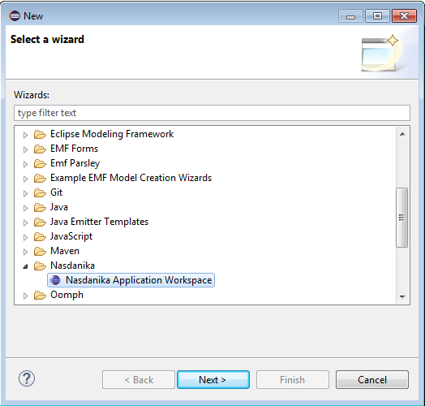
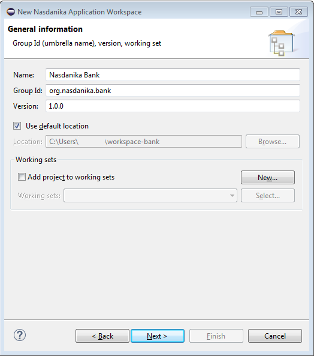
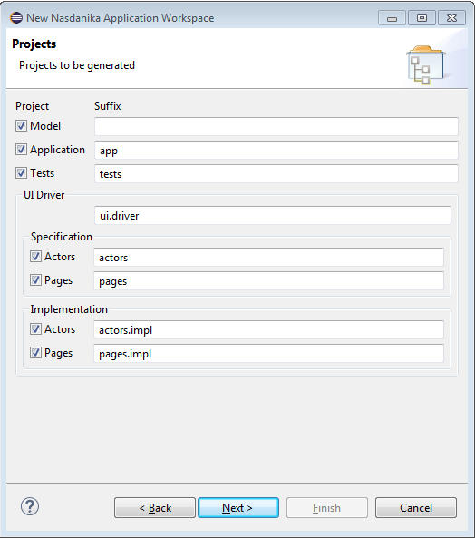
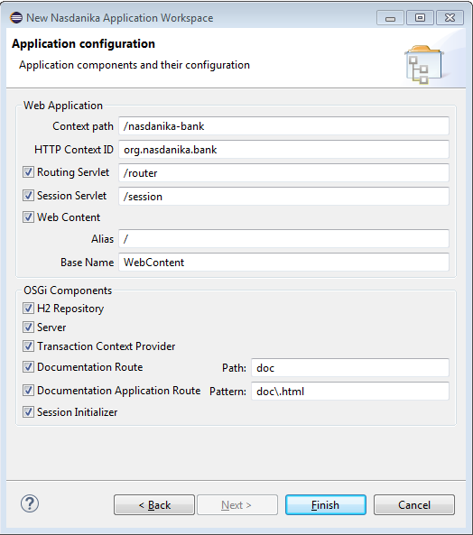
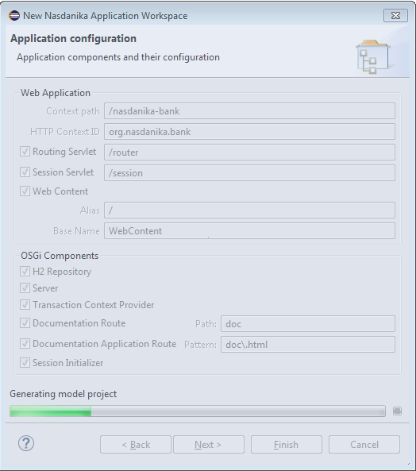
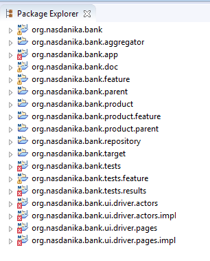
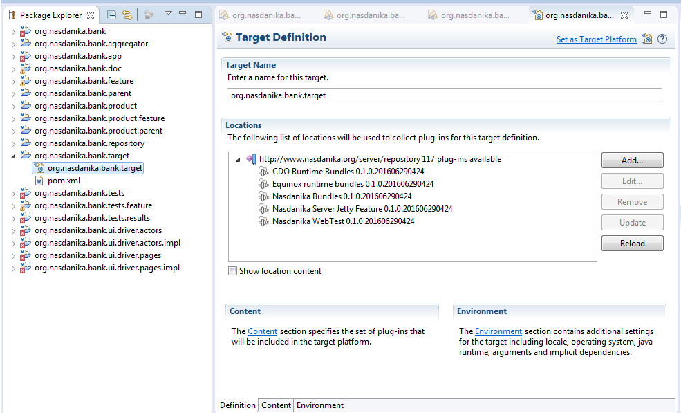
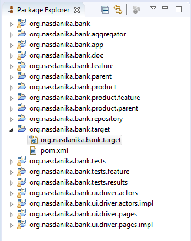

# Generate Application Projects

## Workspace Wizard

We will switch to the Java perspective and then click "File > New > Other", search for ``Nasanika``, or scroll down to Nasdanika. After that we will select the ``Nasdanika Application Workspace`` and click "Next".

### General Information Page

This page contains inputs common for all projects to be generated:

* **Name** - Application name.
* **Group Id** - Common part of artifact/bundle ID's.
* **Location** - A standard Eclipse control group to customize projects location.
* **Working sets** - A standard Eclipse control group to assign projects to working set(s). 

Here we will enter application name and group ID - ``Nasdanika Bank`` and ``org.nasdanika.bank``. We will leave other values to their defaults and click "Next".

### Projects Page

This page allows to select which projects to generate and their ID suffixes. 

* **Model** - If the Model checkbox is selected, then the wizard generates an empty EMF project for the application domain model. The default value of the model suffix is empty, i.e. the model project artifact and bundle ID is equal to the group ID, ``org.nasdanika.bank`` is our case.
* **Application** - If the Application checkbox is selected, then the wizard generates an application project, which contains routing servlet extension and a number of OSGi components. The default suffix for the application project is ``app``, i.e. in our case the application project ID would be ``org.nasdanika.bank.app``. 
* **Tests** - If the Tests checkbox is selected, then the wizard generates a tests project with JUnit/WebTest tests, tests feature, and tests product definition. The default suffix for the tests project is ``tests``, i.e. in our case the tests project ID would be ``org.nasdanika.bank.tests``.
* **UI Driver** - UI driver consists of actor and page specifications (interfaces) and implementations. The first text field defines the first part of UI driver projects' suffixes. The default value is ``ui.driver``:
  * **Specifications** - projects containing UI driver specifications (interfaces):
    * **Actors** - If the Actors specification checkbox is selected, then the wizard generates a  project with actor and actor factory interfaces. The default suffix for the actors specifications project is ``actors``, i.e. in our case the actors specification project ID would be ``org.nasdanika.bank.ui.driver.actors``.
    * **Pages** - If the Pages specification checkbox is selected, then the wizard generates a  project with page and page factory interfaces. The default suffix for the pages specifications project is ``pages``, i.e. in our case the pages specification project ID would be ``org.nasdanika.bank.ui.driver.pages``.
  * **Implementations**
    * **Actors** - If the Actors implementation checkbox is selected, then the wizard generates a  project with implementations of actor and actor factory interfaces. The default suffix for the actors implementations project is ``actors.impl``, i.e. in our case the actors implementations project ID would be ``org.nasdanika.bank.ui.driver.actors.impl``.
    * **Pages** - If the Pages implementations checkbox is selected, then the wizard generates a  project with implementations of page and page factory interfaces. The default suffix for the pages implementations project is ``pages.impl``, i.e. in our case the pages specification project ID would be ``org.nasdanika.bank.ui.driver.pages.impl``.

A more detailed explanation of application projects will be provided below. 

As before we will leave all selections to their defaults and click "Next". 
  
### Application Configuration Page

This page is displayed only if the application project was selected on the projects page. The page allows to customize the application project.

* **Web Application**
  * **Context path** - Application context path. Defaults to the application name lower-cased with spaces replaced by dashes, in our case - ``/nasdanika-bank``
  * **HTTP Context ID** - HTTP Context is used by the Routing and Session servlets. Defaults to the Group ID - ``org.nasdanika.bank``.
  * **Routing servlet** - If selected an extension for the routing servlet is registered in the generated ``plugin.xml``.
  * **Session servlet** - If selected an extension for the sesion servlet is registered in the generated ``plugin.xml``. 
  * **Web Content** - If selected a resource extension for is registered in the generated ``plugin.xml``, the wizard generates ``index.html`` and unpacks content of ``org.nasdanika.web.resources`` bundle to the web content directory: 
    * **Alias** - Web content alias, defaults to ``/``
    * **Base name** - Location of the web content in the application project, defaults to ``WebContent`` 
* **OSGi Components**
  * **H2 Repository** - If selected, the wizard generates a definition of an OSGi component which exposes [org.nasdanika.cdo.RepositoryProvider](http://www.nasdanika.org/server/apidocs/org.nasdanika.cdo/apidocs/org/nasdanika/cdo/RepositoryProvider.html) provider service backed by an embedded [H2](http://www.h2database.com/html/main.html) database. 
  * **Server** - If selected, the wizard generates a definition of an OSGi component which exposes [org.eclipse.emf.cdo.session.CDOSessionProvider](http://help.eclipse.org/neon/topic/org.eclipse.emf.cdo.doc/javadoc/org/eclipse/emf/cdo/session/CDOSessionProvider.html) service.
  * **Transaction Context Provider** - If selected, the wizard generates a definition of an OSGi component which exposes [org.nasdanika.cdo.CDOTransactionContextProvider](http://www.nasdanika.org/server/apidocs/org.nasdanika.cdo/apidocs/org/nasdanika/cdo/CDOTransactionContextProvider.html) service.
  * **Documentation Route** - If selected, the wizard generates a definition of a documentation route OSGi component. The documentation route serves documentation content, but it doesn't provide a container (a web page) for the content.
  * **Documentation Application Route** - If selected, the wizard generates a definition of a documentation application route OSGi component. The documentation route generates a container page for hosting the documentation content.
  * **Session initializer** - If selected, the wizard generates a definition of an OSGi component which exposes [org.nasdanika.cdo.CDOSessionInitializer](http://www.nasdanika.org/server/apidocs/org.nasdanika.cdo/apidocs/org/nasdanika/cdo/CDOSessionInitializer.html) service. Session initializers are used to register session packages and generate initial repository content.  

A more detailed explanation of the application project OSGi services and their interactions will be provided later.

We will leave all values to their defaults and click "Finish". The wizard will start doing its magic and will display a progress bar to notify us about its progress:  

When the Wizard completes there will be 18 projects and some of them with errors: 

## Set Target Platform

To get rid of errors we need to set the target platform. First we shall wait until the target resolves and click "Set as Target Platform".

Once the workspace rebuilds, all errors shall disappear.

## Summary

So now we have a set of projects which constitute our application. In the [next section](run-application-in-eclipse.md) we will run our project from Eclipse. 

A detailed explanation of the role and structure of each project will be provided later. 

