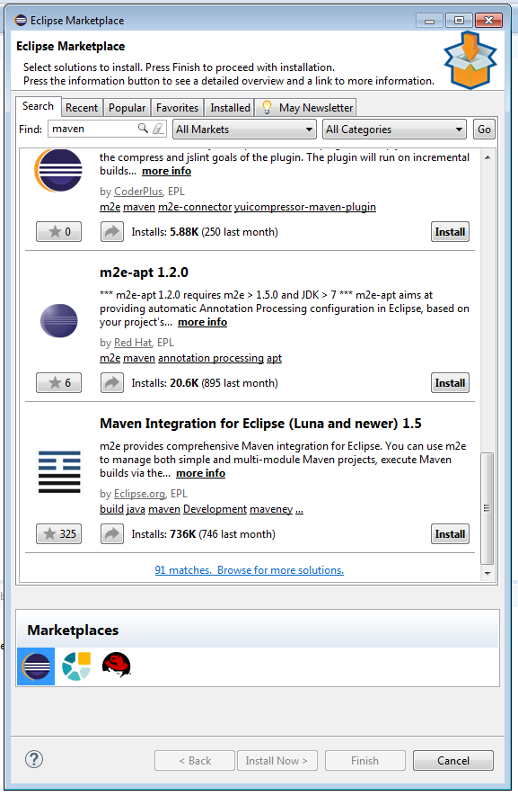

# Install prerequisites

The first step in our journey is to install prerequisites.

## 1. Eclipse
Download [Eclipse Modeling Tools](https://www.eclipse.org/downloads/) for your platform, if you don't have it already.

## 2. Maven/m2e

* Open Eclipse marketplace client (Help > Eclipse Marketplace... menu),

 
* Search for ``Maven``,

* Scroll to "Maven Integration for Eclipse (Luna and newer) 1.5" 

* Click ``Install`` and follow the installation instructions.

* Once installed and restarted - go to "Help > Check for updates" to get the latest version of m2e (1.7.0 as of time of writing)

## 3. Tycho Configurator

* Go to Window > Preferences > Maven > Discovery and click "Open Catalog". 

* Search for ``tycho``, select "Tycho Configurator", click "Finish". Follow the installation instructions.

Tycho resources:

* [Home page](https://eclipse.org/tycho/)
* [Tutorial](http://www.vogella.com/tutorials/EclipseTycho/article.html).

## 4. Eclipse Web Developer Tools

We might need to edit HTML and JavaScript files, so Eclipse Web Developer Tools may come in handy. Go to "Help > Install New Software" menu, select Eclipse release repository (Neon below) and check "Eclipse Web Developer Tools":

.

Follow the installation instructions.

## 5. Nasdanika Application Workspace Wizard and Story Editor

* Open the Eclipse Marketplace Client once again.
* Search for ``Nasdanika``
* Install ``Nasdanika Application Workspace Wizard`` and ``Story Editor``

## 6. Version control
We will also need a client for a version control system. We are going to use Git, so there is no need to install anything, as Git 
client is bundled with Eclipse. 

## 7. Graphviz   
Install [Graphviz](www.graphviz.org) - it will be used behind the scenes for generation of UML diagrams depicting the structure and behavior of our system.

## Summary
Now we have all prerequisites installed and can proceed to [generating application projects](generate-application-projects.md).

Before proceeding to generating application projects it might be a good idea to archive the Eclipse installation and publish it to some shared location so when new people decide to contribute to the application they don't have through the entire installation process again. 
