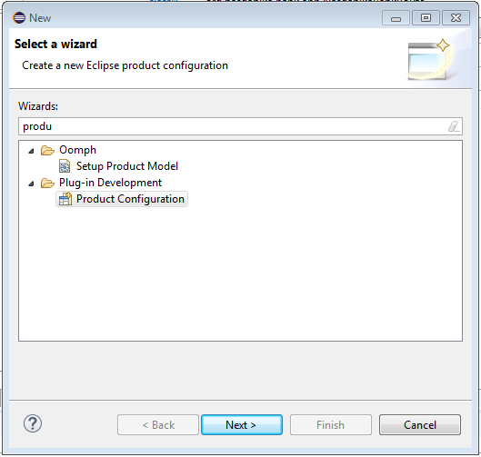

# Run the Application in Eclipse

## Start
To run the application in Eclipse we shall open the ``org.nasdanika.bank.product`` file in the ``org.nasdanika.bank.product`` project and click either ``Launch an Eclipse application`` or ``Launch and Eclipse application in Debug mode``.

When the application starts we should see console output similar to the one below:

There is an error message with a stack trace because we don't have test results yet.

## Navigate to the test route
Now when we open ``http://localhost:8080/nasdanika-bank/router/nasdanika-bank.html`` in a Web browser it shall display a welcome message as shown below:

  

## Navigate to the documentation system
After that we open ``http://localhost:8080/nasdanika-bank/router/doc.html`` and see the Nasdanika Bank Information Center (the documentation system):

It takes some time for the documentation system to index pages - we should check that a message ``Indexed ... pages`` appears twice in the console output before the documentation system can be used.

## Shutdown

We are done with our initial launch. To gracefully shutdown the application type ``shutdown`` in the console and press <Enter>. Wait for several seconds and if the application does not exit type another command, e.g. ``ss``:

## Cleanup the product

The wizard generates a feature-based product which includes many plugins some of which may not be used by the application.
The product can be cleaned-up by going to Debug/Run configuration and un-checking the unneeded bundles.

 

After the cleanup the existing product file shall be deleted or renamed and a new file shall be create from the launch configuration by right-clicking on the product project, selecting "New" and then "Product configuration":

 

After that entering the product file name and selecting an existing launch configuration:

Once a new product file is created it is important to set product ID - otherwise the Maven/Tycho build will fail.

## Summary

By now we have launched our new application from Eclipse IDE and made sure that it works. Launching the application from Eclipse, especially in Debug mode, is the primary way of how developers will use the application.

The next step is to [explore the documentation system](documentation-system-overview.md) so we know how to use it. 

 