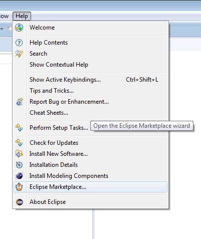
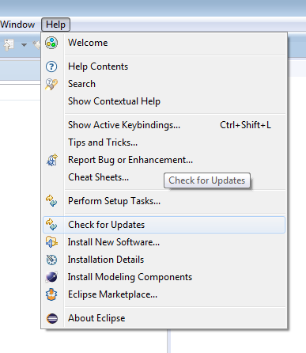

# Setup

Imagine that our boss told us about an upcoming project to build a prototype of an online/mobile banking self-service application.
He informed us that there will be a meeting set up in a day or so to talk to the business folks and clarify requirements. 
So at this point of time all information we have is a potential application name - ``bank`` or ``self-service``. 
Let's say we've decided to stick with ``bank``. 

So, what do we do at this stage with such limited information available? We will:

* [Install prerequisites](install-prerequisites.md):
  * Java, 
  * Eclipse, 
  * Maven Integration for Eclipse,
  * Tycho Configurator,
  * Nasdanika Application Workspace Wizard and Story Edtor,  
  * Graphviz.
* [Generate application projects](generate-application-projects.md)
* [Run the application in Eclipse](run-application-in-eclipse.md)
* [Build and launch the application locally](build-and-launch-locally.md)
* [Dockerize the application](dockerize.md)
* [Set up an automated build](automated-build.md)
  * Publish code to GitHub,
  * Set up build/test job on CircleCI,
  * Set up automated image build on Docker Hub.
  

## 1. Eclipse
Download [Eclipse Modeling Tools](https://www.eclipse.org/downloads/) for your platform, if you don't have it already.

## 2. Maven/m2e

* Open Eclipse marketplace client (Help > Eclipse Marketplace... menu),

 
* Search for ``Maven``,

* Scroll to "Maven Integration for Eclipse (Luna and newer) 1.5" 

* Click ``Install`` and follow the installation instructions.

* Once installed and restarted - go to "Help > Check for updates" to get the latest version of m2e (1.7.0 as of time of writing)

## 3. Tycho Configurator

* Go to Window > Preferences > Maven > Discovery and click "Open Catalog". 

* Search for ``tycho``, select "Tycho Configurator", click "Finish". Follow the installation instructions.

Tycho resources:

* [Home page](https://eclipse.org/tycho/)
* [Tutorial](http://www.vogella.com/tutorials/EclipseTycho/article.html).

## 4. Nasdanika Application Workspace Wizard and Story Editor

* Open the Eclipse Marketplace Client once again.
* Search for ``Nasdanika``
* Install ``Nasdanika Application Workspace Wizard`` and ``Story Editor``

TODO - Screenshot

## 5. Graphviz   
Install [Graphviz](www.graphviz.org) - it will be used behind the scenes for generation of UML diagram depicting the structure and behavior of our system.

## 6. Generate the Application Workspace
Click File > New > Other, search for ``Nasanika`` in the wizard, or scroll down to Nasdanika. Select on the ``Nasdanika Application Workspace``. 

TODO - screenshot(s).

Resolve and set the target platform.

### Workspace Projects
TODO - overview of workspace projects
* ``org.nasdanika.bank`` - Model project, ...
* ``org.nasdanika.bank.aggregator`` - 
* ``org.nasdanika.bank.app`` - Application project, ...
* ``org.nasdanika.bank.doc`` - Documentation project, JavaDoc...
* ``org.nasdanika.bank.feature`` -  
* ``org.nasdanika.bank.parent`` - 
* ``org.nasdanika.bank.product`` - 
* ``org.nasdanika.bank.repository`` - 
* ``org.nasdanika.bank.target`` - 
* ``org.nasdanika.bank.tests`` - 
* ``org.nasdanika.bank.tests.results`` - 
* ``org.nasdanika.bank.tests.results.feature`` - 
* UI Driver
  * ``org.nasdanika.ui.driver.actors`` - Contains actor interfaces and actor factory interface. Actor interface defines...
  * ``org.nasdanika.ui.driver.actors.impl`` - 
  * ``org.nasdanika.ui.driver.pages`` - 
  * ``org.nasdanika.ui.driver.pages.impl`` - 

## 7. Run the application in Eclipse
* Open the product file, 
* Click execute,
* Open the app URL in the browser,
* Open documentation in the browser - bundles, packages, docs.
* Cleanup product - remove not needed bundles - function, sca, promise, scheduler, boxing.
* Build locally, launch, browse the initial application page and documentation, including the automated UI test result.

## 8. Dockerize
* Check-in code to GitHub
* Modify GitHub URL in the generated Docker file.
* Run the file from Eclipse using Docker tools.
* Run the new image using Eclipse Docker tools.
* Open a port on CentOS. 
* Open containerized app in a Web browser.
* Stop the container, remove.
* Push image.
* Commit Dockerfile.

## 9. Customize documentation content
* Show/hide global package, bundles, and NSD content, 
* 3 doc routes - one for developers/contributors with all the details, another for business - user stories, tests, but no bundles and global packages, the last one for techies - no global packages, select bundles, e.g. organization/application bundles and core dependencies. Subclass Doc route to display different headers and maybe to have different styles.  

## Summary

* Inputs - app name
* Outputs - running app with documentation and tests
* Next steps - user stories, actors and tests.

## References
* GitHub URL
* DockerHub URL

 
[TODO]: # (Generate .cmd/.sh files in aggregator to run Maven several times - 1. Package/verify, 2. Materialize products from a local repository including test results)
[TODO]: # (Wizard to generate a test results bundle, output results to it. The bundle is part of the product feature.)
[TODO]: # (Wizard to generate Docker file)
[TODO]: # (Global packages are shown by default)
[TODO]: # (Enhancements in the generated diagram toolbar)
[TODO]: # (JavaDoc bundle and a maven command to generate to that bundle or something like that, javadoc link to the app plugin.xml extension. The bundle shall define a servlet mapped to api-docs and serving JavaDoc resources. javadoc:aggregate) 
