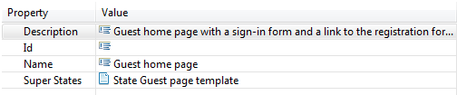
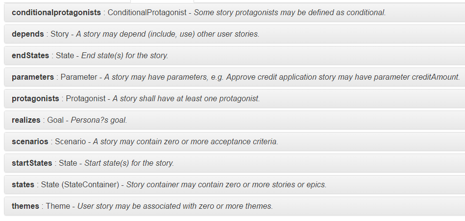
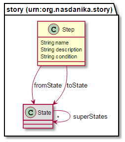
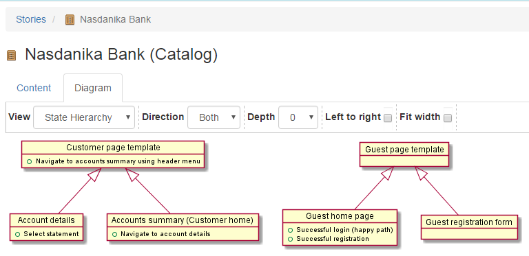

# User Stories

As you probably remember, our boss told us about an upcoming meeting with the business folks.

During the meeting the business told us that the goal of the project was to create a prototype for a self-service banking application, which would feature web and mobile user interfaces and allow visitors to register and authenticate. 

After successful registration/authentication the system shall provide users information about their accounts such as balances and statement transactions.

There are two systems of record (SOR's) - one for checking/savings accounts and the other for credit card accounts. The prototype shall demonstrate pulling data from the both systems. 
Initially the systems can be stubbed. 
As the prototype progresses the stubs shall be replaced with connectors to test instances of the SOR's.

We will keep the registration functionality out of scope for now and will add it later, once all other functionality is in place. 

## Sketches
During the meeting several UI sketches were drawn on a whiteboard and we've been smart enough to take pictures of them 
with a mobile phone camera. 

### Home page
#### Web

#### Mobile

### Post-authentication page
#### Web

#### Mobile

### Account details page
#### Web

#### Mobile

   
   
## Story model   

### Create a model file
The action of this chapter happens after the meeting. We will create a story model to capture the input from the meeting in a structured way and make it available in the documentation system.

To create a story model we click on File > New and select Nasdanika/Story model:

Click Next, select container and enter file name. We will keep our model in the application project and name the model file ``Bank.nasdanika_story``.  
 
Click Next again and select ``Catalog`` as the story model root element:

Click Finish. 

### Add the model file and sketches to the binary build
 
Once we have a model we shall copy sketches to the application project, say to the ``sketches`` folder, and add the model file and the sketches folder to the binary build - plugin.xml, Build tab, Binary Build section:

### Populate the model

Right-click on the root Catalog element, select New child > User:

 

Based on the information we gathered from the meeting with the business we are going to create two users - Guest and Customer. Each of them will have several stories with scenarios. 

Detailed information about the story model can be found in the online documentation:

Below is a quick overview of several model classes.

#### Catalog

Catalog is a generic container for story model elements. It is the root element of our story model.

#### User

User is a human actor. 

User is a sub-type of Protagonist and as such can be linked to EClass representing this User/Protagonist in the domain model.

User can play zero or more Roles and contain zero or more states and stories. 

As a sub-type of Actor it may reference super-actors and contain sub-actors.
 
#### State

Interaction state, e.g. a web page. Scenarios transition from their start state(s) (context, "given") to the end state (outcome, "then").

States can be useful when multiple scenarios share start/end states - it allows to clearly identify shared states.

#### Story

Story represents an agile user story which has the following structure:

**As a** ``Protagonist`` - ``Actor`` (``User``, ``System``) or ``Role``

**I want** ``Goal``

**So that** ``Benefit``

A story can

* Contain scenarios, states, parameters, and conditional protagonists.
* Depend on other stories.
* Reference protagonists. If a story is contained by a protagonist (e.g. in our case stories are defined under users), then the containing protagonist is implicitly added to the story's protagonist list.
* Reference zero or more themes.
* Reference start and end states.
* Realize zero or more Persona's goals.
 
#### Scenario

Scenario has the following format:

**Given** ``Context``

**When** ``Action``

**Then** ``Outcome``

Scenario may contain states and steps. It can also reference zero or more context (start) states and one outcome state.

#### Step

A step in a scenario. For example, user registration or credit application may walk the user through several screens (states).
It can be modeled as scenario-specific states contained in the scenario and a list of steps navigating between the states. 

Steps can be conditional, e.g. an insurance application wizard may have special steps for different regions.

### Register the model with the documentation system
  
Now we need to register the story model to make the documentation system aware of its existence. 
To do so we should first open the application project's ``plugin.xml`` and add ``org.nasdanika.story`` bundle to the list of ``org.nasdanika.bank.app`` bundle dependencies:

And then create an extension for the ``org.nasdanika.story.model`` story element with ``Bank.nasdanika_story`` location:

## Browse story model documentation

Now we can start our application to browse the story model documentation and share it with others.

In the TOC there is a new ``Stories`` node containing ``Nasdanika Bank`` catalog node, which in turn contains nodes
representing story model elements.

The following sub-sections describe documentation content of different node types. 

### Catalog

Catalog documentation may contain the following tabs:

* Description, if catalog description is not blank.
* Content.
* Diagram - auto-generated diagrams visualizing catalog elements and their relationships. 

#### Content tab

#### Diagram tab

Several types of diagrams are generated for all catalog elements:

* Activity diagram is generated only for scenarios which contain steps.
* Use-case diagram if the element is a protagonist or story or contains protagonists and/or stories.
* State hierarchy diagram if the element is a State or contains states.
* State transition diagram if the element is a State or Scenario or contains states and/or scenarios.  

If an element supports more than one diagram type, then a drop-down box is shown in the diagram toolbar allowing to select
a particular diagram (view).

The diagram toolbar contains the following additional controls:

* Direction - dependency direction to traverse during discovery of related elements.
* Depth - traversal depth.
* Left-to-right - allows to change diagram layout. 
* Fit width - scales the diagram to fit the viewport.

When toolbar controls selections are modified the diagram is automatically regenerated and reloaded.

Direction, depth, and left-to-right are not applicable to activity diagrams and are disabled when "Activity" view is selected.

##### State hierarchy

This diagram/view represents views as objects with scenarios which can be initiated from states are fields. 
Sub-states are connected to super-states with the generalization/inheritance connection:

 

##### State transition

This diagram depicts states as... states (what a surprise!) and scenarios as transitions between states. States contained in
scenarios are considered "private" and are not displayed unless referenced by scenarios, which is allowed by the model but shall be avoided - private states shall be referenced by scenario steps, but not by scenarios.

For stories state-transition diagrams also show start and end pseudo-states as will be shown later.

##### Use case

As described above, this diagram contains protagonists and stories. It depicts protagonist-story relations as associations, actor and role inheritance as generalizations and actor-in-role as realizations. 

#### Protagonist

Protagonist (Actor, User, System, Role) documentation contains description, diagram, states and stories tabs:

#### State

State documentation contains description, diagram, sub-states (if any) and super-states (if any) tabs:

In our model documentation we've used ``image`` renderer to link screen sketches to the documentation. 
This renderer generates a link with a picture icon as shown above. Click on the link opens an image dialog:

 

#### Story

Story documentation contains overview, diagram, and scenarios tabs:

If a story defines start and end states, then the state transition diagram depicts start and end pseudo-states:

#### Scenario

Scenario documentation contains overview, diagram, states (if any), and steps (if any) tabs:

If a scenario contains steps, then an activity diagram is generated:

  
 

## Summary

In this chapter we've started with a little bit of requirements and a few sketches. We've put the requirements into a story model and linked the sketches to the model.

Then the documentation system generated several types of UML diagrams from the model we've created. 
These diagrams will be of great help in communicating the purpose of the prototype to the stakeholders.

Tag ``17`` of ``nasdanika/bank`` image at [Doker Hub](https://hub.docker.com/r/nasdanika/bank/) corresponds to the state of our application at the end of this chapter. 

In the [next chapter](../chapter-2-automated-ui-tests/README.md) we will create initial tests and link them to the story model.
These tests will serve as executable specifications for our prototype.  

