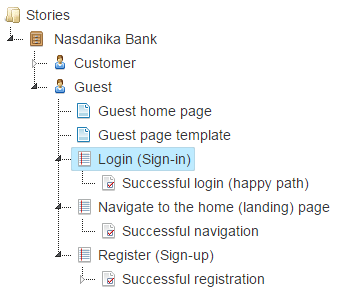
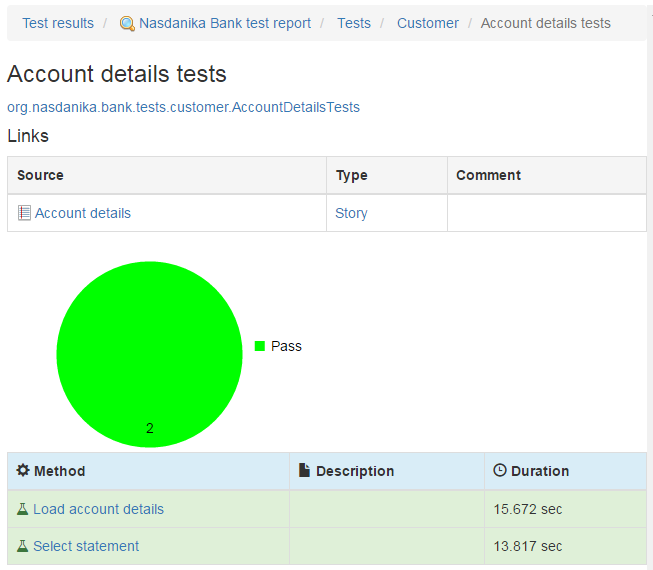

# Pending and NOP tests

In this section we will write tests which do nothing and annotate some of them as pending. We will structure our tests after user stories and scenarios from our story model. 
We will annotate the tests with ``@Link`` annotation along the way to establish references between the user story elements and the tests.

Once we have the tests we will execute them and browse the results in the documentation system.

## Assign ID's to the story model elements

First of all we shall assign ID's to story model elements which are going to be referenced from our tests. 
The screenshot below shows that our user ``Guest`` has ID ``guest``. 


ID's shall be unique within a story model resource (file). Story model elements contained in another story model elements
may reference their container ID using ``${parent}`` token as shown below:


## Write tests

We will use test classes generated by the wizard as templates and, as it was already mentioned, we will model our tests after the story model elements by creating a test class per story and a test method per scenario. 

To help with that we will start the documentation system. We could have opened the story model in Eclipse, but the documentation system conveniently expands ``${parent}`` tokens in element ID's and also displays model element resource location in parenthesis.



Below is a screenshot of the Login user story with ``${parent}.log-in`` id expanded: 


The story has one scenario - ``Successful login (happy path)``.

Based on this information we modify a copy of the generated test to look as shown below:

```java
package org.nasdanika.bank.tests.guest;

import java.awt.GraphicsEnvironment;
import java.util.concurrent.TimeUnit;

import org.junit.After;
import org.junit.Before;
import org.junit.FixMethodOrder;
import org.junit.Test;
import org.junit.runner.RunWith;
import org.junit.runners.MethodSorters;
import org.nasdanika.bank.ui.driver.actors.NasdanikaBankActorFactory;
import org.nasdanika.webtest.ActorFactory;
import org.nasdanika.webtest.Category;
import org.nasdanika.webtest.Link;
import org.nasdanika.webtest.NasdanikaWebTestRunner;
import org.nasdanika.webtest.Pending;
import org.nasdanika.webtest.Title;
import org.nasdanika.webtest.WebTest;
import org.openqa.selenium.WebDriver;
import org.openqa.selenium.firefox.FirefoxDriver;
import org.openqa.selenium.phantomjs.PhantomJSDriver;

@RunWith(NasdanikaWebTestRunner.class)
@FixMethodOrder(MethodSorters.NAME_ASCENDING)
@Title("Log-in")
@Category("Guest")
@Link(
		type = "Story@urn:org.nasdanika.story", 
		value = "org.nasdanika.bank.app/Bank.nasdanika_story#guest.log-in")
public class LogInTests implements WebTest<WebDriver> {
	private WebDriver driver;
	
	@Override
	public WebDriver getWebDriver() {
		return driver;
	}
		
	@ActorFactory
	public NasdanikaBankActorFactory actorFactory;

	@Before
	public void setUp() throws Exception {
        driver = GraphicsEnvironment.isHeadless() ? new PhantomJSDriver() : new FirefoxDriver(); // new ChromeDriver();
        driver.manage().timeouts().pageLoadTimeout(3, TimeUnit.SECONDS);
	}
	
	@Test
	@Pending
	@Title("Successful log-in")
	@Link(
			type = "Scenario@urn:org.nasdanika.story", 
			value = "org.nasdanika.bank.app/Bank.nasdanika_story#guest.log-in.successful-login")
	public void successfulLogIn() throws Exception {
//		Guest actor = actorFactory.createGuest(getWebDriver());
//		NasdanikaBankPage page = actor.navigateToNasdanikaBankPage();
//		Assert.assertNotNull(page); // TODO - implement assertions
	}
	
	@After
	public void quitDriver() throws Exception {
		if (driver!=null) {
	        driver.quit();
	        driver = null;
		}
	}

	@Override
	public long getScreenshotDelay() {
		return 0;
	}	
}
``` 

Here is the summary of changes:

* Moved the test to the ``org.nasdanika.bank.tests.guest`` package.
* Added ``@Category("Guest")`` annotation to the class.
* Added ``@Link`` annotations to the class and to the test method. Each annotation indicates the type of story model element we are linking to and its location in the ``value`` attribute, which is <element location>#<element id>. In our model there are ID clashes between states and scenarios and this is why we explicitly specify element type, for all elements for consistency. If a story element ID is unique within the story resource, then ``type`` attribute can be omitted.

We proceed with the rest of the stories and scenarios for Guest and Customer in a similar fashion. 
We annotate Guest, but not Customer, test methods with ``@Pending`` annotation.  

Also we create test suite classes for Guest and Customer and add them 
to the root test suite. Below is the code of the Guest test suite:

```java
package org.nasdanika.bank.tests.guest;

import org.junit.runner.RunWith;
import org.junit.runners.Suite.SuiteClasses;
import org.nasdanika.webtest.NasdanikaWebTestSuite;

@RunWith(NasdanikaWebTestSuite.class)
@SuiteClasses({
	NavigateToHomePageTests.class, 
	RegisterTests.class,
	LogInTests.class})
public class GuestTests {
	
}
```

## Run tests

There are two ways to run the tests:

* Run ``org.nasdanika.bank.tests.product`` Eclipse application in the ``org.nasdanika.bank.repository`` project. In this case test results will be saved in a directory relative to the Eclipse directory and will need to be moved to the ``org.nasdanika.tests.results`` project in order to be recognized by the documentation system. One option is to create a directory link so when you run tests from Eclipse results end up in the right place.
* Execute Maven/Tycho build as explained in [Setup/Build and launch the application locally](../../../chapter-0-setup/build-and-launch-locally/).

We will use the first approach as it is easier.   


## Browse results

Once we get the tests executed and test results in the right place we launch our application and open the documentation system in the browser:


We see that customer tests all passed - their icon is a flask with green content, 
and guest tests are pending - they have an empty flask icon.

Below is a screenshot of the test session documentation page:

  

If we click on "Account details tests" we will see the following page:



Some things to note:

* Click on the fully qualified name of the test class opens its JavaDoc in a new browser tab.
* There is Links table. Click on the source (Account details) opens the story documentation page.
* Click on the type opens the story element type (EClass) documentation.
* Click on test method names open their documentation pages which also contain links to story elements.

Click on the Account details story link opens the story documentation page: 


 
There is a new tab "Links" with contains a link to the test class results and a link to test results model element type (TestClassResult). 


## Summary

So now we have our tests, which do nothing at this point of time, but they are automatically executed and the test results are bidirectionally linked to the story model elements. 

In the next section we will modify our tests to use the sketches of UI as "screenshots".

Tags:

* Source code - [chapter-2-automated-ui-tests/tests/pending-and-nop](https://github.com/Nasdanika/bank/tree/chapter-2-automated-ui-tests/tests/pending-and-nop)
* Docker image - [19](https://hub.docker.com/r/nasdanika/bank/tags/).

