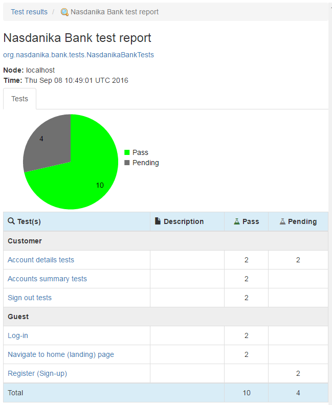

# Tests with sketches

You should recall that the business wants our application to support both mobile and web clients and we already have 
some sketches of mobile and web UI. In this section we will modify our NOP/Pending tests to use the sketches as "screenshots".   

To achieve that we will use [SketchWebDriver](http://www.nasdanika.org/server/apidocs/org.nasdanika.webtest/apidocs/org/nasdanika/webtest/SketchWebDriver.html) instances to instruct the WebTest framework to use sketches from annotations as screenshots. 

## Tests refactoring

### Base class

Because we will need to provide screenshots for web and mobile, we will convert our tests to parameterized tests.
And to avoid code duplication, we will define a base class for our tests by making a copy of ``NasdanikaBankRouteTest`` and adjusting it to our needs:

```java
package org.nasdanika.bank.tests;

import static org.junit.Assert.fail;

import java.util.ArrayList;
import java.util.Collection;
import java.util.List;

import org.junit.After;
import org.junit.Before;
import org.junit.FixMethodOrder;
import org.junit.runner.RunWith;
import org.junit.runners.MethodSorters;
import org.junit.runners.Parameterized.Parameter;
import org.junit.runners.Parameterized.Parameters;
import org.nasdanika.bank.ui.driver.actors.NasdanikaBankActorFactory;
import org.nasdanika.webtest.ActorFactory;
import org.nasdanika.webtest.NasdanikaParameterizedWebTestRunner;
import org.nasdanika.webtest.WebTest;
import org.nasdanika.webtest.WebTestUtil;
import org.openqa.selenium.WebDriver;

/**
 * Base class for tests. It handles driver creation and release.
 * @author Pavel Vlasov
 *
 */
@RunWith(NasdanikaParameterizedWebTestRunner.class)
@FixMethodOrder(MethodSorters.NAME_ASCENDING)
public abstract class NasdanikaBankTestBase implements WebTest<WebDriver> {
	
	public enum DriverType {
		sketch
//		firefox, 
//		chrome, 
//		ie, 
//		phantomjs 
	} 
	
	public enum ClientType {
		web,
		mobile
	}
		
	@Parameters(name="{index}: {0}")
	public static Collection<Object[]> getParameters() {
		List<Object[]> ret = new ArrayList<>();
		for (DriverType driverType: DriverType.values()) {
			for (ClientType clientType: ClientType.values()) {
				ret.add(new Object[] { driverType, clientType });
			}
		}
		return ret;
	}
	
	@Parameter(0)
	public DriverType driverType;
	
	@Parameter(1)
	public ClientType clientType;	
	
	@Override
	public WebDriver getWebDriver() {
		return driver;
	}
		
	private WebDriver driver;
		
	@ActorFactory
	public NasdanikaBankActorFactory actorFactory;	

	@Before
	public void setUp() throws Exception {
		switch (driverType) {
		case sketch:
			driver = WebTestUtil.createSketchWebDriver(driverType.name()+"/"+clientType.name());
			break;
//		case firefox:
//	        driver = new FirefoxDriver();
//	        driver.manage().timeouts().pageLoadTimeout(20, TimeUnit.SECONDS);
//			break;
//		case phantomjs:
//	        driver = new PhantomJSDriver();
//	        driver.manage().timeouts().pageLoadTimeout(20, TimeUnit.SECONDS);
//			break;
		default:
			fail("Unsupported driver type: ");		
		}
	}
	
	@After
	public void quitDriver() throws Exception {
		if (driver!=null) {
	        driver.quit();
	        driver = null;
		}
	}

	@Override
	public long getScreenshotDelay() {
		return 0;
	}
	
}
```

This class defines two enumerations - ``DriverType`` and ``ClientType``, which are used as test parameters. 
The ``DriverType`` enumeration currently defines one value ``sketch``, with other values commented out for future use.

The ``ClientType`` enumeration defines two values ``web`` and ``mobile``. 
   
``getParameters()`` method returns a set of test vectors covering all possible permutations of ``DriverType`` and ``ClientType`` enumeration values.

As the system and a set of tests evolve, more parameters may be added, e.g. orientation and screen size, 
and more parameter values, e.g. different browser and mobile device drivers - Firefox, Chrome, IE, Appium for Android with different devices, Appium for iOS. 
Consequently, the number of all possible permutations will grow significantly and it might be wise to switch to combinatorial testing.
For now, however, the exhaustive set of all possible parameter combinations is just what we need. 

The ``setUp()`` method uses ``driverType`` and ``clientType`` parameter values to create
an instance of ``WebDriver``. Currently it creates an instance of ``SketchWebDriver``.

``quitDriver()`` method quits the driver.

### Add @Sketch Annotation

Once we have a base class for tests, we shall modify our tests to extend this base class and also
add [Sketch](http://www.nasdanika.org/server/apidocs/org.nasdanika.webtest/apidocs/org/nasdanika/webtest/Sketch.html) annotations. The code snippet below shows the modified ``LogInTests`` class, other test classes were modified in similar fashion:

```java
package org.nasdanika.bank.tests.guest;

import org.junit.Test;
import org.nasdanika.bank.tests.NasdanikaBankTestBase;
import org.nasdanika.webtest.Category;
import org.nasdanika.webtest.Link;
import org.nasdanika.webtest.Sketch;
import org.nasdanika.webtest.Title;

@Title("Log-in")
@Category("Guest")
@Link(
		type = "Story@urn:org.nasdanika.story", 
		value = "org.nasdanika.bank.app/Bank.nasdanika_story#guest.log-in")
public class LogInTests extends NasdanikaBankTestBase {
	
	@Test
	@Title("Successful log-in")
	@Sketch(
			before="bundle://org.nasdanika.bank.app/sketches/guest-home-web.png",
			after="bundle://org.nasdanika.bank.app/sketches/customer-home-web.png",
			selector="sketch/web")
	@Sketch(
			before="bundle://org.nasdanika.bank.app/sketches/guest-home-mobile.png",
			after="bundle://org.nasdanika.bank.app/sketches/customer-home-mobile.png",
			selector="sketch/mobile")
	@Link(
			type = "Scenario@urn:org.nasdanika.story", 
			value = "org.nasdanika.bank.app/Bank.nasdanika_story#guest.log-in.successful-login")
	public void successfulLogIn() throws Exception {
//		Guest actor = actorFactory.createGuest(getWebDriver());
//		NasdanikaBankPage page = actor.navigateToNasdanikaBankPage();
//		Assert.assertNotNull(page); // TODO - implement assertions
	}
		
}
```   

Now the class extends ``NasdanikaBankTestBase`` and the test method has two ``@Sketch`` annotations - one for the web and the other for the mobile sketches.


## Test results
After completing tests refactoring we re-run the tests and start the documentation system to browse the test results.

### TOC
In the TOC tree we see a hierarchy of test parameters values with test method results are leaf nodes:

 

### Test session
When we click on the test session we can see that we now have 14 tests, 10 passing and 4 pending:



### Parameterized test class
The Guest/Log-in test page shows test parameters, and a table with different parameter combinations:


### Parameters combination (test vector)
Click on the number ``2`` navigates to the test result page for the ``sketch``, ``web`` parameters combination:


This page has a table of parameters with values, and a table of test methods, which we currently have only one. 

### Test method
Click on the method name opens the test method result page:

  

This time the result has a carousel with screenshots, which are actually our sketches. Currently there are two "screenshots" - before (above) and after the test:


### Link to a scenario
If we click on the "Successful login (happy path)" scenario link, we will see that now the scenario 
has two linked tests with the same name and parameter values in parentheses:


## Summary

In this section we have laid the foundation for gradually evolving our tests to support progressive
continuous elaboration of user experience. 
In subsequent sections we will create wireframes and mockup screens based on the sketches and our test results will show them side-by-side in order to demonstrate
to the stakeholders that, say, a wireframe is an elaboration of a corresponding sketch, 
and not something completely different.

## References

* [Sources](https://github.com/Nasdanika/bank/releases/tag/chapter-2-automated-ui-tests%2Ftests%2Fsketches)
* Docker image - [21](https://hub.docker.com/r/nasdanika/bank/tags/)

