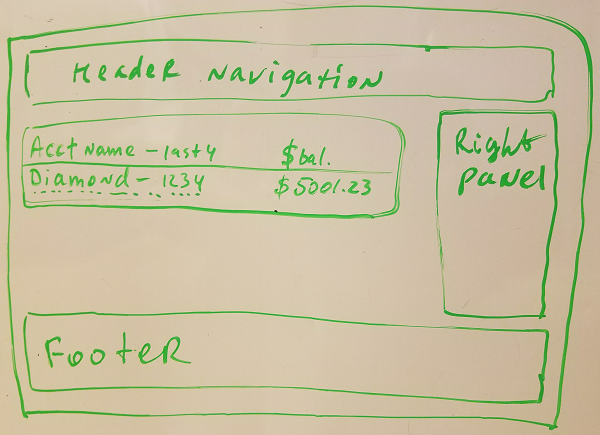
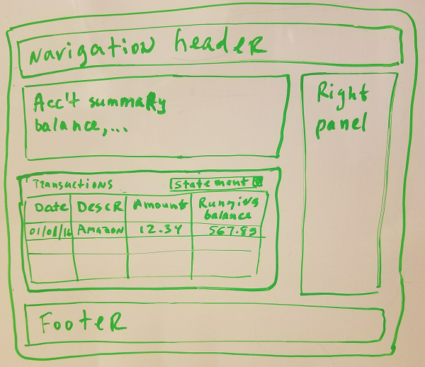

# UI Driver Specification

UI Driver abstracts tests from low-level details of user interfaces. 
Essentially, the UI Driver is an [embedded/internal DSL](https://en.wikipedia.org/wiki/Domain-specific_language#Domain-specific_language_topics) in which tests are written.

In Nasdanika WebTest the UI driver consists of 4 components in two logical layers:

* Actors - express coarse "business" functionality, e.g. "Log-In" or "Submit Payment". 
  * Specification - factory and actor interfaces. May or may not depend on the page specification. 
  * Implementation - implementations of the specification written in terms of page specifications. Page implementations are wired at runtime via [OSGi Declarative Services](http://www.vogella.com/tutorials/OSGiServices/article.html#the-osgi-declarative-services-functionality).
* Pages - represent low-level UI functionality, e.g. "Enter User ID", "Enter Password", "Click Sign-On Button" for the "Log-In" actor method.
  * Specification - factory and page interfaces.
  * Implementation - implementation of the specification, typically using [Selenium WebDriver](http://www.seleniumhq.org/projects/webdriver/) to automate web browsers and/or mobile devices.  


We already have a story model with users, stories, scenarios, steps. 


With this information creation of the UI Driver specification is rather straightforward.

We will create:

* Guest and Customer actors for Guest and Customer users.
* Pages for states.   
* Actor methods for stories.
* Actor or page methods for steps.

As with the tests we will use [@Link](http://www.nasdanika.org/server/apidocs/org.nasdanika.webtest/target/site/apidocs/org/nasdanika/webtest/Link.html) annotation to establish traceability between the UI driver interfaces and the story model elements.

## Actors

WebTest actor interfaces correspond to protagonists (Roles, Actors, Users, Systems) in the story model with interface methods corresponding to stories. 

As stories transition between states and states are represented by pages, it might seem logical for actor methods to return page interfaces. However, it introduces a dependency between the actor and page specifications, which might be not be desirable. The current page can be accessed via ``Actor.getCurrentPage()`` method.

### Factory

Factory is responsible for creation of instances of ``Guest`` actor. 

```java
package org.nasdanika.bank.ui.driver.actors;

import org.nasdanika.bank.ui.driver.pages.NasdanikaBankPageFactory;
import org.openqa.selenium.WebDriver;

public interface NasdanikaBankActorFactory {
	
	NasdanikaBankPageFactory getPageFactory();
	
	Guest createGuest(WebDriver webDriver);

}
```   

### Guest

Below is the ``Guest`` interface. It has a link to the ``Guest`` user in the story model.
Interface methods correspond to the ``Guest`` user stories and have links to the corresponding stories.
There is also a helper method to create a customer for testing.

```java
package org.nasdanika.bank.ui.driver.actors;

import org.nasdanika.webtest.Actor;
import org.nasdanika.webtest.Description;
import org.nasdanika.webtest.Link;
import org.openqa.selenium.WebDriver;

@Description("Guest, a.k.a. Vistior or 'Unauthenticated principal'")
@Link(
		type = "User@urn:org.nasdanika.story", 
		value = "org.nasdanika.bank.app/Bank.nasdanika_story#guest")
public interface Guest extends Actor<WebDriver> {
		
	/**
	 * Navigates to the home page. The page can be accessed by invoking <code>getCurrentPage</code> method.
	 */
	@Link(
			type = "Scenario@urn:org.nasdanika.story", 
			value = "org.nasdanika.bank.app/Bank.nasdanika_story#guest.navigate-home")
	@Description("Navigate to the landing page")
	void navigateToHomePage();
	
	/**
	 * Logs in to the system
	 * @param userId User ID
	 * @param password Password
	 * @return Instance of the customer upon successful log-in.
	 * @throws IllegalArgumentException If login fails. <code>getCurrentPage()</code> method can be used in this case to 
	 * access to the {@link GuestHomePage} for further analysis, e.g. to read the error message.
	 */
	@Link(
			type = "Scenario@urn:org.nasdanika.story", 
			value = "org.nasdanika.bank.app/Bank.nasdanika_story#guest.log-in")
	@Description("Log in to the system")
	Customer logIn(String userId, String password);

	/**
	 * Registers a new customer
	 * @return Instance of the customer upon successful registration.
	 * @throws IllegalArgumentException If registration fails. <code>getCurrentPage()</code> method can be used in this case to 
	 * access to the current page for further analysis.
	 */
	@Link(
			type = "Scenario@urn:org.nasdanika.story", 
			value = "org.nasdanika.bank.app/Bank.nasdanika_story#guest.sign-up")
	@Description("Registers customer")
	Customer register(/* TODO - registration data */);
	
	/**
	 * Helper method to simplify testing.
	 * @param alias Customer alias. If null, then the alias is set to "Customer".
	 * @return Test customer
	 */
	@Description("Generates random but unique customer registration data and registers a customer")
	TestCustomer createTestCustomer(String alias);

}
```

### Customer


``Customer`` interface corresponds to the ``Customer`` user in the story model and is linked to it. 
It contains nested interfaces representing accounts, statements and transactions.  

```java
package org.nasdanika.bank.ui.driver.actors;

import java.util.List;

import org.nasdanika.webtest.Actor;
import org.nasdanika.webtest.Delegate;
import org.nasdanika.webtest.Description;
import org.nasdanika.webtest.Link;
import org.openqa.selenium.WebDriver;

@Description("Logged-in customer, authenticated principal")
@Link(
		type = "User@urn:org.nasdanika.story", 
		value = "org.nasdanika.bank.app/Bank.nasdanika_story#customer")

public interface Customer extends Actor<WebDriver> {
	
	/**
	 * A delegate actor for working with the account data.
	 * @author Pavel Vlasov
	 *
	 */
	@Link(
			type = "Scenario@urn:org.nasdanika.story", 
			value = "org.nasdanika.bank.app/Bank.nasdanika_story#customer.account-details.load")
	@Description("Load account details")
	interface Account extends Actor<WebDriver>, Delegate {
						
		List<Statement> getStatements();
		
		/* TODO - account attributes - balance, next statement closing date, ...
		 *  Maybe a hierarchy of accounts 
		 *  - base,
		 *  - checking - just extends the base, or deposit account interface with checking and savings as sub-interfaces - move to own package and classes in this case.  
		 *  - credit 
		 *    - credit line - total/available, 
		 *    - cash credit line - total/available, 
		 *    - last payment, 
		 *    - last payment date
		 */
		
	}
	
	/**
	 * A delegate actor for working with the statement data.
	 * @author Pavel Vlasov
	 *
	 */
	@Link(
			type = "Scenario@urn:org.nasdanika.story", 
			value = "org.nasdanika.bank.app/Bank.nasdanika_story#customer.account-details.select-statement")
	@Description("Select account statement")
	interface Statement extends Actor<WebDriver>, Delegate {
		
		List<Transaction> getTransactions();
		
	} 
	
	/**
	 * A delegate actor for working with the transaction data.
	 * @author Pavel Vlasov
	 *
	 */
	interface Transaction extends Actor<WebDriver>, Delegate {
		
		
		
	} 
	
	/**
	 * Retrieves a list of customer accounts.
	 */
	@Link(
			type = "Scenario@urn:org.nasdanika.story", 
			value = "org.nasdanika.bank.app/Bank.nasdanika_story#customer.account-summary")
	@Description("Retrieve a list of customer accounts")
	List<Account> getAccounts();
	
	/**
	 * Logs out.
	 * @return A guest instance upon successful log-out.
	 * @throws IllegalStateException If log-out fails. 
	 */
	@Link(
			type = "Scenario@urn:org.nasdanika.story", 
			value = "org.nasdanika.bank.app/Bank.nasdanika_story#customer.sign-out")
	@Description("Log out from the system")
	Guest logOut();


}
```

### TestCustomer

``TestCustomer`` is a helper interface to simplify testing. 

```java
package org.nasdanika.bank.ui.driver.actors;

/**
 * Helper class to simplify testing. Tests customers are created with
 * random but unique registration data. 
 * @author Pavel Vlasov
 *
 */
public interface TestCustomer extends AutoCloseable {
	
	/*
	 * Maybe a better way is to have an interface RegistrationInfo and a method getRegistrationInfo(). 
	 */
	
	/**
	 * @return User ID
	 */
	String getUserId();

	/**
	 * @return Password
	 */
	String getPassword();
	

}
```

## Pages

### Factory

The factory is responsible for creation of "entry-points" pages.

```java
package org.nasdanika.bank.ui.driver.pages;

import org.nasdanika.bank.ui.driver.pages.guest.Home;
import org.openqa.selenium.WebDriver;

public interface NasdanikaBankPageFactory {
	
	/**
	 * Navigates to the guest home page and creates a page instance.
	 * @param webDriver
	 * @return
	 */
	Home navigateToGuestHomePage(WebDriver webDriver);

	/**
	 * Creates a page instance.
	 * @param webDriver
	 * @return
	 */
	Home createGuestHomePage(WebDriver webDriver);
	
}
```

Our entry-point page is guest home. There are two methods to create this page:

* ``navigateToGuestHomePage()`` navigates the browser to the page URL and then creates a page instance.
* ``createGuestHomePage()`` creates a page instance without modifying the browser state, i.e. assuming that the 
browser has already been navigated to the guest home. 


### Guest

Pages correspond to states in the story model. For ``Guest`` user we have a template "abstract" state and two concrete states. 
We will put guest pages into ``package org.nasdanika.bank.ui.driver.pages.guest`` package
and add this package to the list of exported packages in the pages specification bundle manifest file:

 


#### Template

The template interface extends ``NasdanikaBankPage`` and currently doesn't have any methods. 

```java
package org.nasdanika.bank.ui.driver.pages.guest;

import org.nasdanika.bank.ui.driver.pages.NasdanikaBankPage;

public interface Template extends NasdanikaBankPage {

}
```

#### Home page

The home page interface extends the template interface and provides methods to enter login, password, click the "Log In" and 
access the error message text if log in fails. 

```java
@Link(
		type = "State@urn:org.nasdanika.story", 
		value = "org.nasdanika.bank.app/Bank.nasdanika_story#guest.home-page")
public interface Home extends Template {
	
	@Sketch(
			before="bundle://org.nasdanika.bank.app/sketches/guest-home-web.png",
			after="guest-home-web-login.png",
			selector="sketch/web")
	@Sketch(
			before="bundle://org.nasdanika.bank.app/sketches/guest-home-mobile.png",
			after="guest-home-mobile-login.png",
			selector="sketch/mobile")	
	void setLogin(String login);
	
	@Sketch(
			after="guest-home-web-password.png",
			selector="sketch/web")
	@Sketch(
			after="guest-home-mobile-password.png",
			selector="sketch/mobile")	
	void setPassword(String password);
	
	@Sketch(
			after="guest-home-web-clickLogInButton.png",
			selector="sketch/web")
	@Sketch(
			after="guest-home-mobile-clickLogInButton.png",
			selector="sketch/mobile")	
	NasdanikaBankPage clickLogInButton();
	
	String getLogInErrorMessage();

}
```

``clickLogInButton()`` method returns a page, which can be the customer home page if log-in was successful, or the guest home page if 
log-in failed. 

The interface is annotated with ``@Link`` annotation pointing to the 
corresponding State in the story model. The interface methods are annotated with ``@Sketch`` annotation for 
simulating "screenshots".

You can see that some sketch annotations reference images relative to the interface. 


  
These images are copies of the original sketches with "activated" UI elements highlighted. 
Guest home web sketch with the Sign-On button highlighted is shown below:


#### Registration form

Currently registration is out of scope, so the registration page doesn't declare any methods.

```java
package org.nasdanika.bank.ui.driver.pages.guest;

public interface RegistrationForm extends Template {

}
```

### Customer

Customer has a template "abstract" state, accounts summary (home) state, and account details state. 
We will create page interfaces corresponding to these states in ``org.nasdanika.bank.ui.driver.pages.customer`` package and export it:


#### Template

The template has ``clickLogOut()`` method, which returns the Guest home page upon successful log-out. 
It also has ``goHome()`` method for navigating to the accounts summary page using the top navigation menu. 

```java
package org.nasdanika.bank.ui.driver.pages.customer;

import org.nasdanika.bank.ui.driver.pages.NasdanikaBankPage;

public interface Template extends NasdanikaBankPage {
	
	org.nasdanika.bank.ui.driver.pages.guest.Home logOut();
	
	Home goHome();

}
```

#### Home

The customer home page has a list of customer accounts with each item in the list displaying account label, 
which is the accounts's product name with the last 4 digits of the account number, and the current balance:



Click on the account label navigates to the account details page.

The home page interface declares a nested interface ``AccountSummary`` and a method returning a list of account summaries.

```java
package org.nasdanika.bank.ui.driver.pages.customer;

import java.math.BigDecimal;
import java.util.List;

import org.nasdanika.webtest.Link;
import org.nasdanika.webtest.Sketch;

@Link(
		type = "State@urn:org.nasdanika.story", 
		value = "org.nasdanika.bank.app/Bank.nasdanika_story#customer.accounts-summary")
public interface Home extends Template {
	
	interface AccountSummary {
		
		String getLabel();
		
		BigDecimal getBalance();
		
		AccountDetails navigateToDetails();
		
	}
		
	@Sketch(
			after="bundle://org.nasdanika.bank.app/sketches/customer-home-web.png",
			selector="sketch/web")
	@Sketch(
			after="bundle://org.nasdanika.bank.app/sketches/customer-home-mobile.png",
			selector="sketch/mobile")
	List<AccountSummary> getAccountSummaries();
	
}
```

#### Account Details

Account details page provides additional details about the account, such as next statement closing date, 
and displays transactions for a particular account statement. 
There is a drop-down which allows to select a statement to display:  
 


We are not that interested in the account summary header right now because our goal is to have a UI driver which can
demonstrate navigation between different parts of the application. 
Therefore, the account details page interface focuses on selection of statements for now:

```java
package org.nasdanika.bank.ui.driver.pages.customer;

import java.math.BigDecimal;
import java.util.Date;
import java.util.List;

import org.nasdanika.webtest.Link;
import org.nasdanika.webtest.Sketch;

@Link(
		type = "State@urn:org.nasdanika.story", 
		value = "org.nasdanika.bank.app/Bank.nasdanika_story#customer.accounts-summary")
public interface AccountDetails extends Template {
	
	interface Statement {
		
		interface Transaction {
			
			Date getDate();
			String getDescription();
			BigDecimal getAmount();
			BigDecimal getRunningBalance();
			
		}
		
		String getLabel();
		
		@Sketch(
				after="account-details-select-statement-web.png",
				selector="sketch/web")
		@Sketch(
				after="account-details-select-statement-mobile.png",
				selector="sketch/mobile")
		List<Transaction> select();
		
	}
	
	@Sketch(
			after="bundle://org.nasdanika.bank.app/sketches/account-details-web.png",
			selector="sketch/web")
	@Sketch(
			after="bundle://org.nasdanika.bank.app/sketches/account-details-mobile.png",
			selector="sketch/mobile")
	List<Statement> getStatements();

}
```  

## Summary

With the specification ready we will now proceed to implementation. 